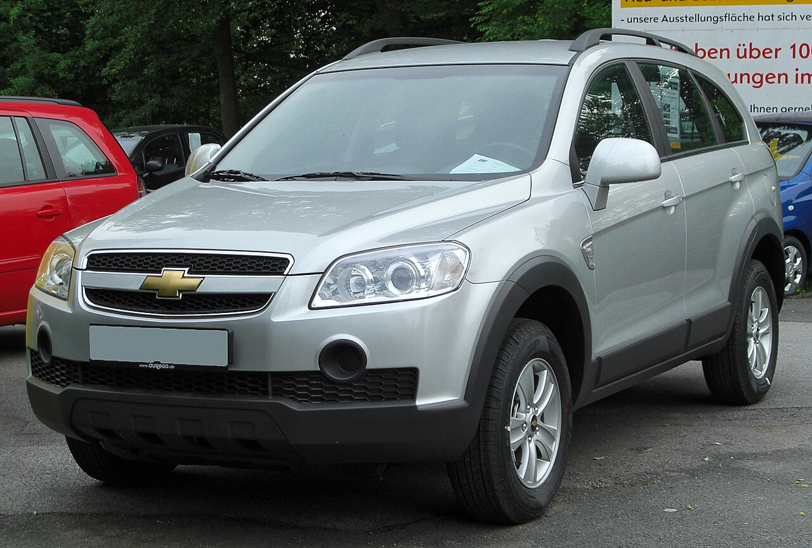
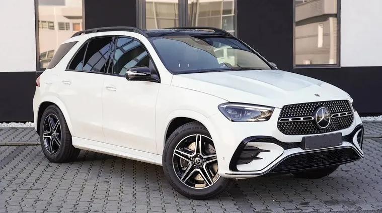

# Driver's License

I hold a category AM, B, and B1 driver’s license, received on 2019-06-11 (valid until 2034-06-11).  
I’ve been an active driver since 2019, comfortable with both automatic and manual transmissions.

I passed the written exam with full marks.
The practical exam took me two attempts - nerves got me the first time, but I passed confidently on the second.

## Recently Driven Vehicles

Below are some of the cars I’ve recently driven.
All of them are owned by my family, who let me use them as if they were my own.

- **Chevrolet Captiva**

  

- **Opel Mokka 1.4 Turbo**

  

- **Mercedes-Benz GLE300d 4MATIC AMG Line**

  
