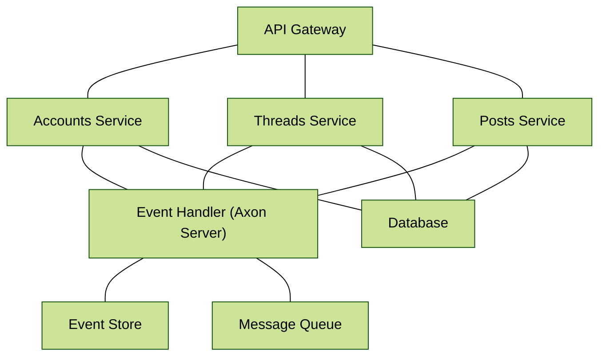
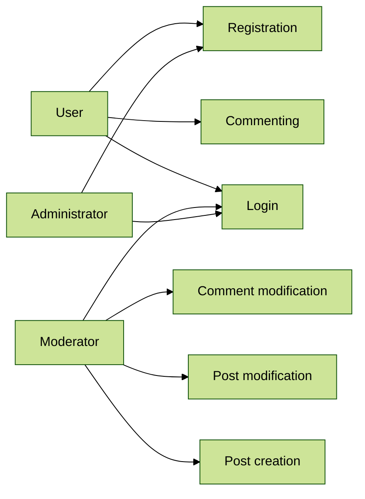
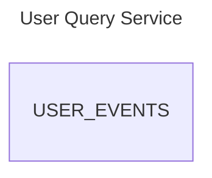
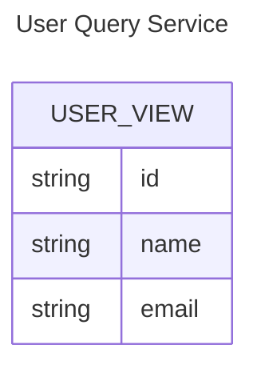
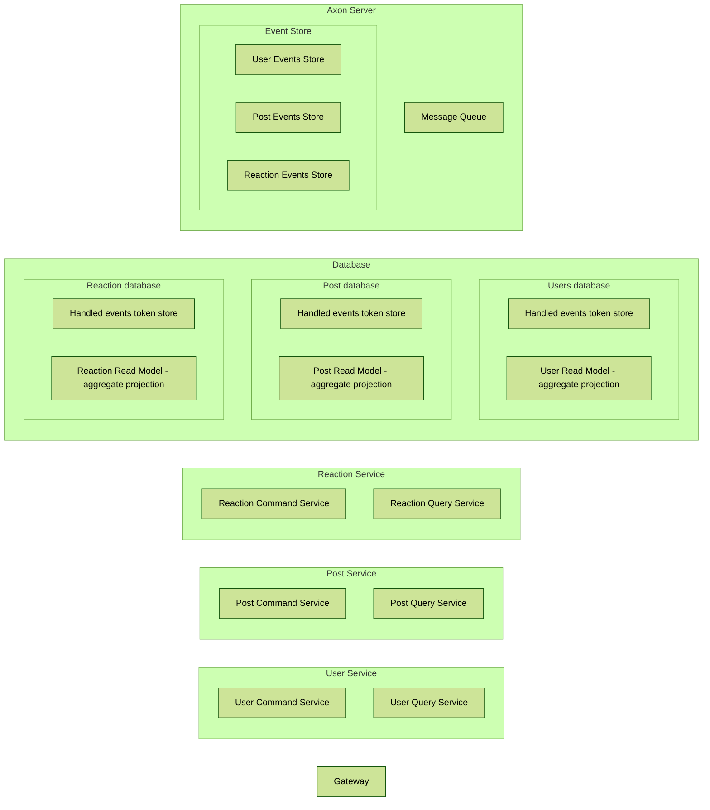
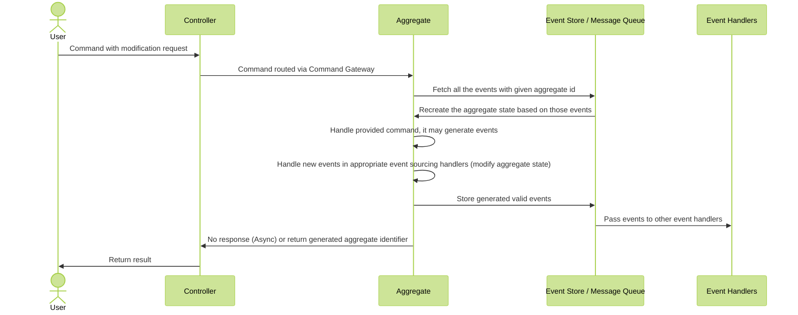
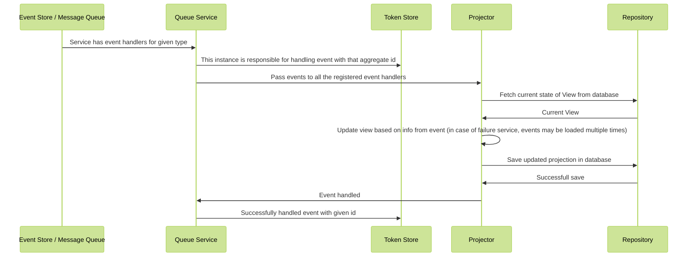
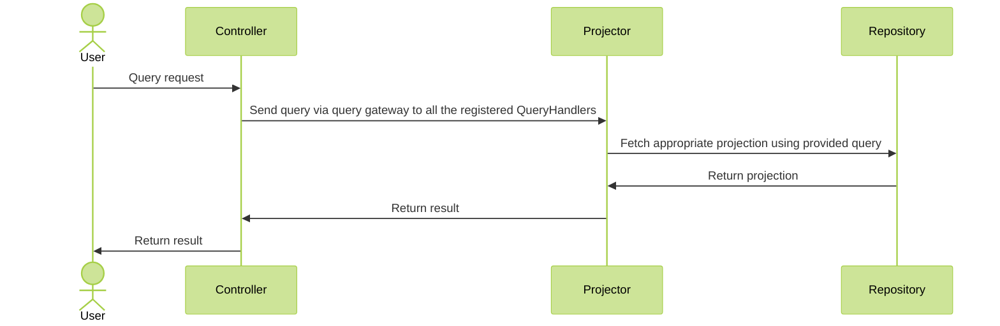
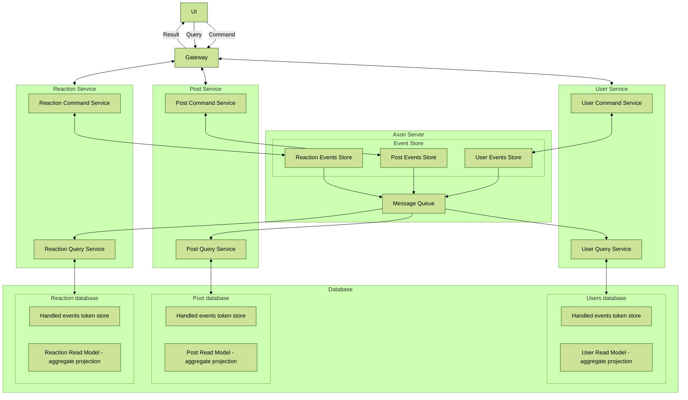

import Figure from "@components/markdown/Figure.astro";

import actions from "@assets/content/ersms/actions.png";
import actions2 from "@assets/content/ersms/actions2.png";
import axon_cqrs from "@assets/content/ersms/axon_cqrs.png";
import commits from "@assets/content/ersms/commits.png";
import dependabot from "@assets/content/ersms/dependabot.png";
import elk from "@assets/content/ersms/elk.png";
import ersms_forum from "@assets/content/ersms/ersms_forum.png";
import ghPackages from "@assets/content/ersms/ghPackages.png";
import github_integration from "@assets/content/ersms/github_integration.png";
import grafana_stats from "@assets/content/ersms/grafana_stats.png";
import grafana from "@assets/content/ersms/grafana.png";
import keycloak_roles from "@assets/content/ersms/keycloak_roles.png";
import kibana from "@assets/content/ersms/kibana.png";
import prometheus from "@assets/content/ersms/prometheus.png";
import statistics from "@assets/content/ersms/statistics.png";

# ERSMS

Building scalable systems is one thing. Building them in a distributed, fault-tolerant, production-like environment - as a student project - is something entirely different.
This project began as an ambitious challenge: create a modern forum platform that doesn't just _work_, but actually demonstrates the same architectural principles used by today's cloud-native companies.

What started as a simple idea quickly grew into a fully distributed ecosystem built around microservices, CQRS, event sourcing, observability, and Kubernetes orchestration.
The goal wasn't just to ship features - it was to understand how real systems behave under load, fail gracefully, recover automatically, and scale without friction.

# Project Overview

The platform is designed as a collection of independent microservices communicating through asynchronous messaging. Every major action-creating posts, registering users, updating threads-is captured as an **event**, stored reliably, and streamed to other services in real time. This event-driven design not only improves performance but also makes the system transparent and easy to audit.

On the read side, a dedicated query service maintains optimized materialized views. This is the **CQRS pattern** in action: commands and queries split into separate models, each specialized for its own task. It makes the platform feel responsive and ensures consistent performance even as the dataset grows.

# Cloud-Native Foundations

From the beginning, the goal was to treat infrastructure as a first-class part of the project. All services run in **Kubernetes**, benefiting from containerized deployments, automatic restarts, horizontal scaling, and declarative configuration. The environment mirrors real-world DevOps setups, making the system resistant to failure and easy to extend.

Security is handled using **OAuth2**, enabling safe authentication flows and clear separation between public and protected endpoints. Combined with API gateways and strict service boundaries, the platform follows production-grade security practices.

<Figure
  src={axon_cqrs}
  alt="Source: https://docs.axoniq.io/reference-guide/architecture-overview"
  width="80%"
  style="background: white; padding: 1rem;"
/>

# Observability & Operations

A distributed system is only as good as its observability. That's why the project includes a full monitoring stack:
logs, metrics, dashboards, and request traces. This allowed us to track bottlenecks, detect failures, and watch services interact in real time. Debugging becomes not just easier-but almost enjoyable-when the system explains itself through dashboards and traces.

<Figure src={elk} alt="ELK Stack for gathering logs" width="80%" />
<Figure src={statistics} alt="Gathering Statistics" width="90%" />

Automated CI/CD pipelines close the loop, ensuring consistent builds, tests, and deployments. Any change in the codebase flows through the pipeline and lands safely in the cluster without manual intervention.

<Figure src={actions} alt="Github Actions" width="80%" />

# Project in details

## Topic

Forum-like application:

- Users can create new threads, where they become a moderator.
- Users create posts under multiple threads
- Users can vote a post up or down.
- Users can edit and delete posts they've created.
- Moderators can remove posts from threads they moderate.
- Moderators can ban users from posting under a thread they moderate.
- Moderators can appoint and remove new moderators for threads they moderate.
- Administrators have the same power as moderators on all threads.
- Administrators can ban users from posting under every thread.

## Microservices

- Business logic
- Database (DBaaS)
- Gateway
- CQRS Event handler

## Cache

- The posts microservice caches user account names, for which the accounts microservice is the authoritative data source.
- The threads microservice caches first post content, for which the posts microservice is the authoritative data source.

### Control version system usage, like git

We are using github.

<Figure src={commits} alt="Commit Messages" width="80%" />

### Automation in infrastructure build and and setup

<Figure src={actions} alt="Github Actions" width="98%" />
<Figure src={actions2} alt="Github Actions - Build & Publish" width="98%" />

As a part of CI, we have prepared three pipelines:

- Build - run every time when someone creates a pull requests and updates it
- Build & Publish - responsible for building all java libraries, frontend and docker images, then publish all artifactas to the Github repository. Runs after merging pull request into main.
  <Figure src={ghPackages} alt="Github Packages" width="80%" />
- Update Gradle Wrapper - responsible for updating Gradle when a new version is released. Runs every week.

We have Dependabot which is responsible for updating all libraries. If it detects that a newer verison is available, it creates a pull request with the update. Runs every week.

<Figure src={dependabot} alt="Dependabot" width="80%" />

### At least three types of microservices

- Business logic
  - Accounts Service
  - Threads Service
  - Posts Service
- Database (DBaaS)
  - MongoDB
  - Postgres (Keycloak)
- Security Management
  - Keycloak - open-source identity and access managment solution
- Gateway
  - Gateway Service
- UI Server
  - Nginx - web server delivering static site content (HTML, CSS, and JavaScript files).
- CQRS Event handler (Message Broker)
  - Axon Server - stores all events and monitors whether the events will be executed by service.

### Monitoring of the service, collecting all the logs

Monitoring:

- Prometheus
  - Node Exporter - running on all of the nodes
  - Prometheus - server that
- Grafana
  - statistics vizualization

<Figure src={statistics} alt="Gathering Statistics" width="80%" />

<Figure src={prometheus} alt="Prometheus Dashboard" width="98%" />

<Figure src={grafana} alt="Grafana Dashboard" width="98%" />

Log aggregation:

- File beat
  - running on all of the nodes
  - it is responsible for collecting logs from services running on a node
  - it sends the logs to the main logstash service
- Log Stash
  - is responsible for log transformation, enrichement and then sending the result to the elasticsearch
- Elasticsearch
  - database that stores all of the logs
  - allows for fast queries
- Kibana
  - gui created for easy queries on elasticsearch

<Figure src={elk} alt="ELK Stack for gathering logs" width="80%" />

Elasticsearch:

```json
{
  "name": "elasticsearch-es-default-0",
  "cluster_name": "elasticsearch",
  "cluster_uuid": "qWXtWZ2qTiq5d2TbPFy3kQ",
  "version": {
    "number": "8.13.0",
    "build_flavor": "default",
    "build_type": "docker",
    "build_hash": "09df99393193b2c53d92899662a8b8b3c55b45cd",
    "build_date": "2024-03-22T03:35:46.757803203Z",
    "build_snapshot": false,
    "lucene_version": "9.10.0",
    "minimum_wire_compatibility_version": "7.17.0",
    "minimum_index_compatibility_version": "7.0.0"
  },
  "tagline": "You Know, for Search"
}
```

Kibana:

<Figure src={kibana} alt="Kibana dashboard" width="98%" />

### Local mirror

- The posts microservice caches user account names, for which the accounts microservice is the authoritative data source.
- The threads microservice caches first post content, for which the posts microservice is the authoritative data source.

When an object is created or updated, to all listening services is sent a messeage in an event. Each service update their own data caches with received information.

To obtain authorative data, we must contact to the service that stores the data. We do this using a "query" message.

<Figure
  src={axon_cqrs}
  alt="Source: https://docs.axoniq.io/reference-guide/architecture-overview"
  width="80%"
  style="background: white; padding: 1rem;"
/>

### Authorization, session management and identities

> Authentication demo: [Google Drive](https://drive.google.com/file/d/1Q_2drNV9X_3YGKlgVHZOuqItsgpHzLrM/view?usp=sharing)

To allow both the administrator login and identities federated via OAuth - we decided to integrate with Keycloak - an open source identity and access management solution that offers features like single sign-on (SSO), user federation, and social login, delegating the security responsibilities to production ready software reducing the need for custom security implementations.

<Figure
  src={github_integration}
  alt="Keycloak - Github integration"
  width="80%"
/>

After signing in, a JWT token is generated. Later the token is validated inside the backend services. The JWT token is validated against Keycloak [JWT set](https://datatracker.ietf.org/doc/html/rfc7517#section-5) containing the certificate used to sign the JWT token.

> This approach could be safer if the certificate was manually copied e.g. during the deployment. In the used approach it is assumed that the Keycloak service is trusted.

<Figure src={keycloak_roles} alt="Keycloak - roles" width="80%" />

Keycloak maps each user to authorization scopes which are later verified using `Spring Security`:

```kotlin
@PreAuthorize("hasAnyAuthority('${Scopes.USER.READ}')")
```

Keycloak uses OpenID Connect (OIDC) which is an identity layer built on top of OAuth 2.0. It is used for authentication, allowing clients to verify the identity of the end-user based on the authentication performed by an authorization server.

(Not yet implemented) When creating a new account (e.g. using social login) an event is sent to the backend to also create a new account inside the `Accounts` service. It is going to be implemented as a custom authentication flow.

### User interface GUI

Creating new thread:

<Figure src={ersms_forum} alt="Forum post" width="80%" />

### Risk analysis with threat model of the service

- Broken Access Control
  - only registred users have access to our service
  - Keycloak enforces role-based access control (RBAC) to ensure proper authorization. It provides fine-grained access control policies for resource protection.
- Cryptographic Failures
  - we enforce communitcation with tls 1.2+
- Injection
  - we validate values and types of request, such as checking if UID is UID, if emails are in the correct format
  - insted of raw SQL, we use ORAM, JPA, Spring Data
  - on the frontend, we use security attributes to prevent XSS, such as InnterText and TextContent
  - Keycloak uses secure serialization and deserialization libraries and practices. It validates and sanitizes input during deserialization to prevent object injection attacks.
- Insecure Design
  - Each component is isolated and only has access to required informations
- Security Misconfiguration
  - Keycloak offers easy-to-configure security settings and provides default secure configurations. It regularly updates and patches security vulnerabilities, reducing the risk of misconfiguration.
- Vulnerable and Outdated Components
  - we are using DependaBot which make pull request with update of an component
- Identification and Authentication Failures
  - we enforce logging through other social portals (SSO), and we do not store passwords except for administratiors, who are manually created
- Software and Data Integrity Failures
  - we use a dedicated repository and Docker itself ensures the consistency of runing images.
- Security Logging and Monitoring Failures
  - logs are saved, and access to them is only for authenticated administrators
  - we do not store any passwords in logs
- Server-Side Request Forgery
  - an app doesn't make any request on behalf of the user and SSRF is not possible

Every service has own self signed certificate.

A certificates are created for this domain:

```
*.ersms-forum.svc.cluster.local
```

We only trust addresses from this domain.

Services that neeed another service have been configured to trust certificates of each service - their certificates have been added to the "Trust Store".

Eg. MongoDB has a certificate added and services that use this datebase have it added as trusted.

### Stress on reliability of the service

Every service has two replicas in case one stops woking.

We are using Goolgle services for increased security and the option to select better machines.

Pods are located in different physical locations.

<Figure src={grafana_stats} alt="Grafana reliability stats" width="98%" />

## Technologies

- Kotlin w/ Spring & Axon
- Github Actions - building, testing & publishing
- Kubernetes



# Architecture

## Use Cases

- use case
- story boards
- scenarios



## Logical View

- end user / customer
- class
- object
- package
- composite
- state machine



<br />



## Development View

- software engineer
- manager
- component



## Process View

- Solution architect
- Sequence
- Communication
- Activity
- Timing
- Interaction overview

Micro-service main component communication

- command handling



- query service updating the state



- querying the query service



## Psychical View

- Software architect
- Deployment

Almost deployment view


