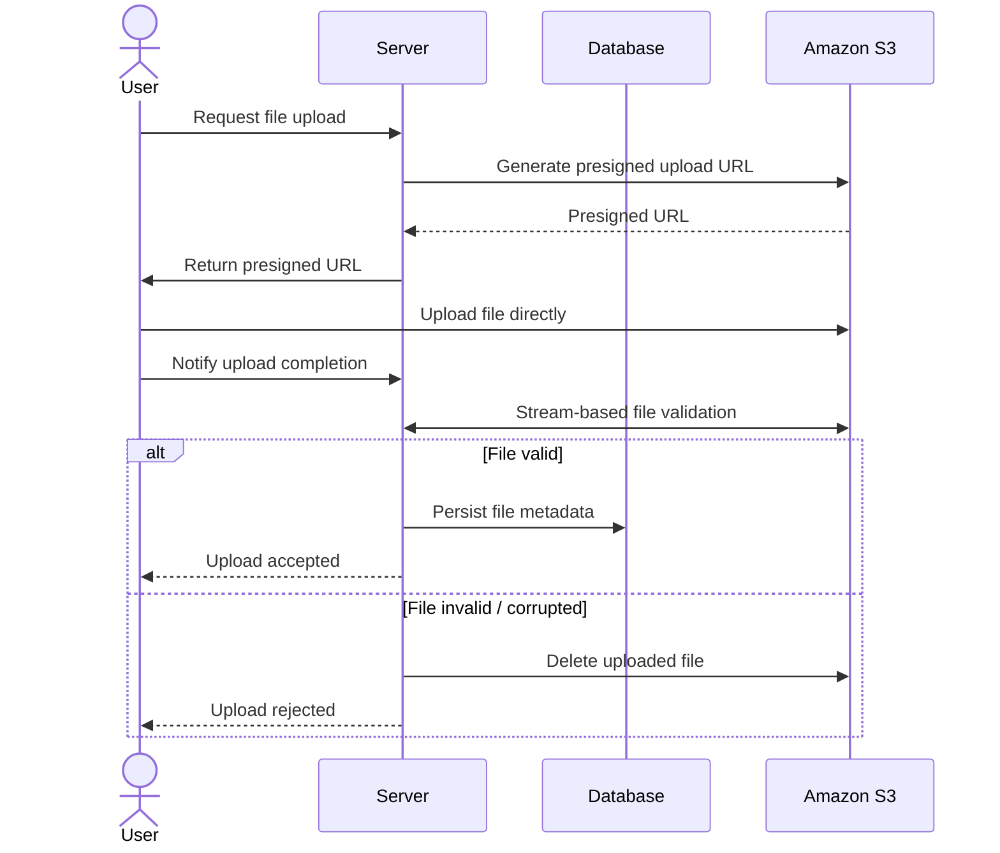
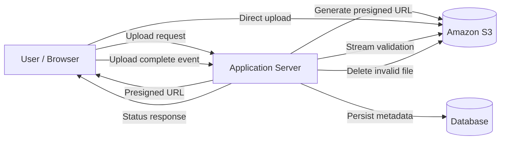

# Project Overview

This project was one of the first large-scale features I implemented independently and represented a major architectural improvement to the platform. The primary goal was to add robust support for very large files (multiple gigabytes), which was a hard requirement introduced by one of the university clients.

The use case involved visualizing large point-cloud datasets directly in the browser. Frontend integration with the open-source library Potree was relatively straightforward; the real challenge was designing a backend architecture capable of reliably storing, transferring, and processing extremely large files without exhausting application memory or degrading system performance.

# Problem Statement

At the time the project started, file handling was implemented in a non-scalable way:

- Files were stored directly in MongoDB.
- File retrieval relied on loading entire files into memory as byte arrays rather than using streaming APIs.

This approach was not viable for multi-gigabyte files and led to excessive memory usage, poor performance, and runtime failures.

# Solution and Architecture

I redesigned the file management layer to support streaming-based file handling and externalized large file storage to Amazon S3.

Key architectural decisions included:

- Migrating large file storage from MongoDB to Amazon S3.
- Introducing presigned S3 URLs to allow clients to upload files directly to S3, bypassing the application server.
- Refactoring existing file-handling code to use input streams and byte streams instead of in-memory byte arrays.
- Updating all affected code paths across the application to align with the new streaming-based approach.

## High-Level Flow

 

 

# File Validation and Processing

After a successful upload to S3:

- The backend verifies file integrity, format, and content compatibility.
- Unsupported or invalid files are rejected and immediately removed from S3 to avoid unnecessary storage costs.
- Valid files are registered in the system and made available for further processing and visualization.

# Performance Optimization

As part of this project, I also optimized PDF watermarking for large documents:

- The existing watermarking solution failed on large files and frequently threw exceptions.
- I refactored the implementation to use streaming-based processing.
- After the changes, the system successfully handled PDF watermarking for files up to 5 GB and beyond without stability issues.

# Key Outcomes

- Enabled reliable handling of multi-gigabyte files.
- Significantly reduced memory usage through streaming-based I/O.
- Improved system scalability and robustness.
- Unblocked advanced data visualization use cases for university clients.
- Established a reusable architectural pattern for large file handling across the platform.
