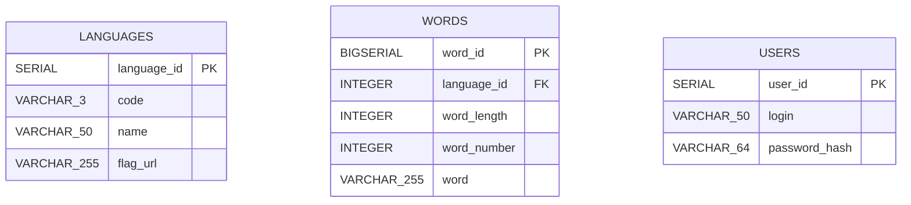
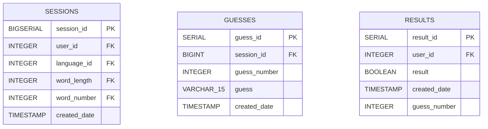
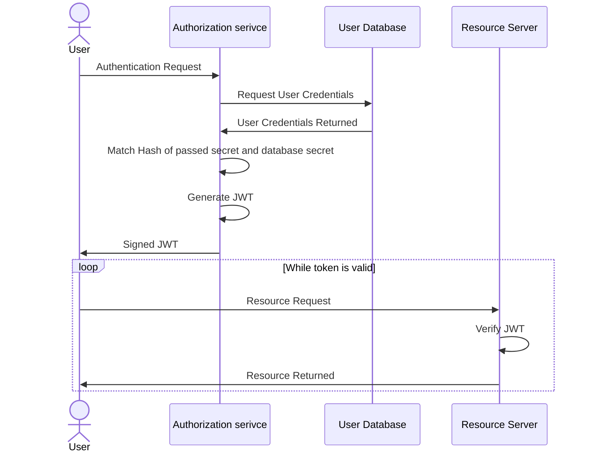

import Figure from "@components/markdown/Figure.astro";

import login from "@assets/content/wordle/login.png";
import registration from "@assets/content/wordle/registration.png";
import swagger_logic from "@assets/content/wordle/swagger_logic.png";
import swagger_security from "@assets/content/wordle/swagger_security.png";
import wordle_light from "@assets/content/wordle/wordle_light.png";
import wordle_night from "@assets/content/wordle/wordle_night.png";

# Wordle Clone

A modern full-stack implementation of **Wordle**, the popular word-guessing game. The player must guess a hidden five-letter word within six attempts. After each guess, the game provides feedback showing:

- letters in the correct position,
- letters that exist in the answer but are placed incorrectly,
- letters that do not appear in the target word at all.

---

# Implementation

## Database

The application uses a **PostgreSQL 15.2** database (`wordledb`) running in a local Docker environment on port `5432`.
The schema uses basic serial/bigserial types to automate ID generation.

### Data Model (Part 1)



### Data Model (Part 2)



---

## Back End

The backend consists of **two independent microservices**:

- `SESSION`
- `AUTHORIZATION`

### Session Service

Manages the game flow. Authenticated users can start a new game session and submit guesses.
The service validates guesses, checks the target word, and returns the result coloring.

### Authorization Service

Handles user registration, login, and security.
Authentication is implemented using **JSON Web Tokens (JWT)**.

Below is an overview of the security flow:



### Building the Project

The project uses **Gradle** for build automation.
You can run the application with:

```
./gradlew clean build bootRun
```

### Swagger API

Each service exposes a Swagger UI for testing endpoints.
Available after running Docker at:

- [http://localhost:7777/swagger](http://localhost:7777/swagger)
- [http://localhost:7788/swagger](http://localhost:7788/swagger)

<Figure src={swagger_logic} alt="Wordle API endpoints" width="80%" />
<Figure src={swagger_security} alt="Security API endpoints" width="80%" />

---

## Front End

The frontend consists of three files located:

- `index.html`
- `style.css`
- `app.js`

### HTML

Defines the visual structure of the page:

- Main area with the guess grid and visual keyboard
- A header with theme-switching, login, and registration buttons
- Popup windows for login/registration via redirect

### CSS

Styles the interface:

- Colors, fonts, spacing
- Support for **dark** and **light** themes
- Uses Google **Material Icons**

### JavaScript

Handles game logic and user interaction:

- Managing keyboard input (both on-screen and physical keyboard)
- Sending asynchronous `fetch()` requests to the backend
- Rendering guess results and managing session flow

---

# Running the Application

1. Build and start the Docker environment:

   ```
   docker compose up --build
   ```

2. Wait until all containers finish initialization
   (look for `Application availability state ReadinessState changed to ACCEPTING_TRAFFIC` in the `session` service logs).

3. Open the application in your browser under:

   **[http://localhost](http://localhost)**

   > Important: use `localhost` instead of `127.0.0.1` due to CORS restrictions.

---

# Examples

## Game screen (dark mode)

<Figure src={wordle_night} alt="Wordle GUI - night theme" width="80%" />

## Game screen (light mode)

<Figure src={wordle_light} alt="Wordle GUI - light theme" width="80%" />

## Registration panel

<Figure src={registration} alt="Wordle GUI - registration panel" width="80%" />

## Login panel

<Figure src={login} alt="Wordle GUI - login panel" width="80%" />
