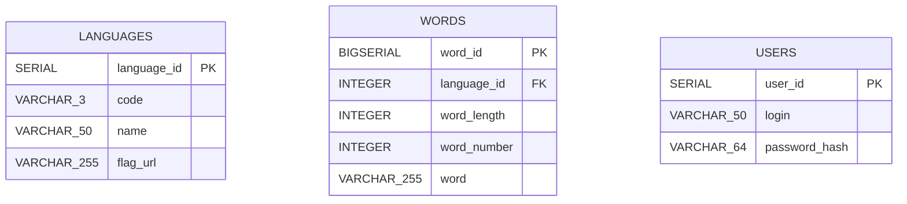
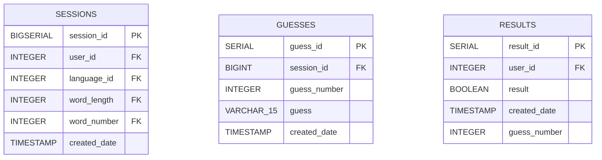
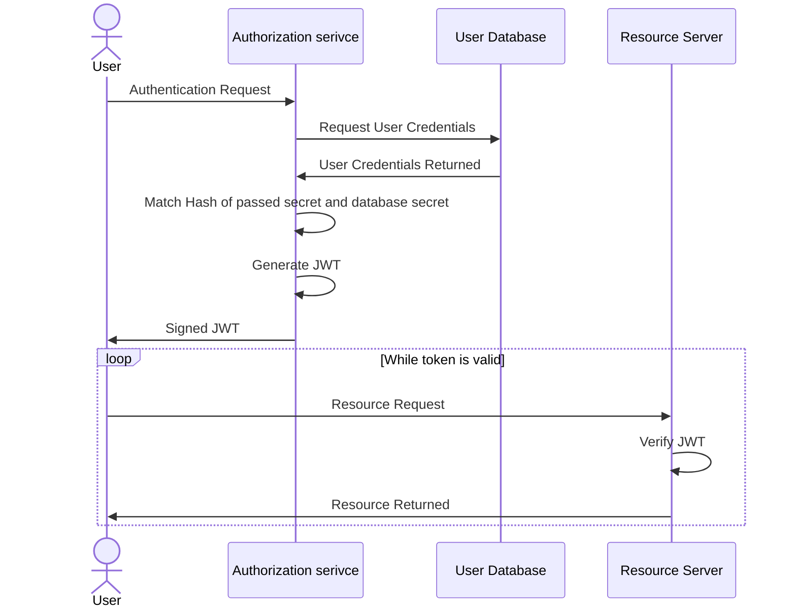

import Figure from "@components/markdown/Figure.astro";

import login from "@assets/content/wordle/login.png";
import registration from "@assets/content/wordle/registration.png";
import swagger_logic from "@assets/content/wordle/swagger_logic.png";
import swagger_security from "@assets/content/wordle/swagger_security.png";
import wordle_light from "@assets/content/wordle/wordle_light.png";
import wordle_night from "@assets/content/wordle/wordle_night.png";

# Temat

Wordle - gra polegająca na odgadnięciu pięcioliterowego słowa. Użytkownik ma do dyspozycji sześć prób, a po każdej próbie gra informuje go, czy użyte litery znajdują się w słowie-odpowiedzi i w jakim dokładnie miejscu, czy też znajdują się w słowie-odpowiedzi, ale w innym miejscu, albo też nie znajdują się w słowie-odpowiedzi w ogóle.

# Implementacja

## Baza danych

Baza danych PostgreSQL 15.2 wordledb działa na środowisku dockerowym na localhoscie, port 5432. Po stronie bazy nie skorzystaliśmy z programowania, jedynie użyliśmy typów serial, aby zautomatyzować nadawanie identyfikatorów dla rzędów. Służy ona głównie do przechowywania danych zbieranych na potrzebę aplikacji. Cała struktura jest sformułowana w pliku DATABASE/scripts/DATABASE_CREATE.sql.



<br />



## Back End

Część backend-owa składa się z dwóch niezależnych serwisów: `SESSION` i `AUTHORIZATION`.

SESSION odpowiada za zarządzanie rozgrywką. Zalogowani użytkownicy mogą zgłosić się w celu nawiązania sesji (rozgrywki). W ramach gry przesyłają kolejnymi zapytaniami słowa. Serwis weryfikuje czy słowo jest poprawne i zwraca rezultat.

AUTHORIZATION odpowiada za zarządzanie użytkownikami oraz zapewnienie bezpieczeństwa. To ten serwis umożliwia rejestrację oraz logowanie. W ramach projektu skorzystaliśmy z autoryzacji za pomocą JSON Web Token. Generalny zarys stosowanego przez nas modelu bezpieczeństwa:



**Budowanie projektu**

W ramach projektu skorzystaliśmy z narzędzia do automatycznego budowania - `gradle`. Projekt można uruchomić z lini poleceń wywołując:

```
./gradlew clean build bootRun
```

**Swagger**

Aby ułatwić testowanie serwisu dodaliśmy do projektów endpoint ze swaggerem. Pozwala on na łatwe wywoływanie endpointów bez korzystania z zewnętrznych narzędzi. Po uruchomieniu dockera swagger jest dostępny pod adresem odpowiednio http://localhost:7777/swagger oraz http://localhost:7788/swagger

<Figure src={swagger_logic} alt="Wordle API endpoints" width="80%" />
<Figure src={swagger_security} alt="Security API endpoints" width="80%" />

## Front End

Część frontendową aplikacji stanowią 3 pliki znajdujące się w podfolderze `public-html` folderu `FE`, tj. `index.html`, `style.css` oraz `app.js`.

HTML:

- Plik HTML zawiera strukturę strony internetowej. Składa się z różnych elementów, takich jak nagłówek, sekcje itp.,
- W sekcji nagłówka umieszczony jest tytuł aplikacji "Wordle",
- W sekcji głównej znajduje się obszar, w którym będzie wyświetlany obecny stan gry, tj. próby zgadnięć i ich rezultaty oraz pomocnicza klawiatura, obrazująca wykorzystane litery,
- W prawym górnym rogu aplikacji widnieją trzy przyciski: zmiany motywu (domyślny: `ciemny` oraz `jasny`), logowania oraz rejestracji; dwa ostatnie po kliknięciu powodują wyświetlenie okienka typu pop-up (za pomocą przekierowania na odpowiedni adres URL).

CSS:

- Arkusz stylów CSS jest używany do określania wyglądu i układu elementów HTML,
- Dla różnych elementów zastosowano różne style, takie jak kolory, czcionki, marginesy, wyrównanie, tło itp., aby nadać aplikacji atrakcyjny wygląd,
- Została użyta zewnętrzna biblioteka CSS - Material Icons, aby mieć dostęp do gotowych ikonek.

JavaScript:

- Skrypt JavaScript jest używany do dodawania interaktywności do aplikacji,
- Zdefiniowano funkcje obsługujące różne zdarzenia, takie jak np. kliknięcie przycisku "Enter",
- Oprócz wpisywania zgadywanego słowa za pomocą wyżej wspomnianej klawiatury wyświetlanej na ekranie (co jest kluczowym mechanizmem jeśli chodzi o np. korzystanie z aplikacji na urządzeniu mobilnym) dla wygody użytkownika istnieje również opcja wpisywania kolejnych liter za pomocą fizycznej klawiatury komputera,
- Do kontaktu z Back Endem wykorzystywane są asynchroniczne zawołania typu "fetch"; sama "rozmowa" polega na przesyłaniu odpowiednich HTTP Requestów.

# Uruchomienie

1. Postawić obrazy, na których zbudowana jest aplikacja, za pomocą komendy `docker compose up --build`,
2. Poczekać, aż wszystkie kontenery zakończą proces wstawania (zazwyczaj można to rozpoznać po tym, że w kontenerze `session` widnieje `Application availability state ReadinessState changed to ACCEPTING_TRAFFIC` w logach,
3. W przeglądarce można wejść na adres `localhost` i cieszyć się grą (ważne, żeby był to **localhost**, a **nie 127.0.0.1** z powodu CORS (Cross-Origin Resource Sharing), ponieważ tylko adres http://localhost/ zostanie zaakceptowany przez Back End.

# Przykłady

- Ekran gry (tryb ciemny):

<Figure src={wordle_night} alt="Wordle GUI - night theme" width="80%" />

- Ekran gry (tryb jasny):

<Figure src={wordle_light} alt="Wordle GUI - light theme" width="80%" />

- Okno rejestracji:

<Figure src={registration} alt="Wordle GUI - registration panel" width="80%" />

- Okno logowania:

<Figure src={login} alt="Wordle GUI - login panel" width="80%" />
