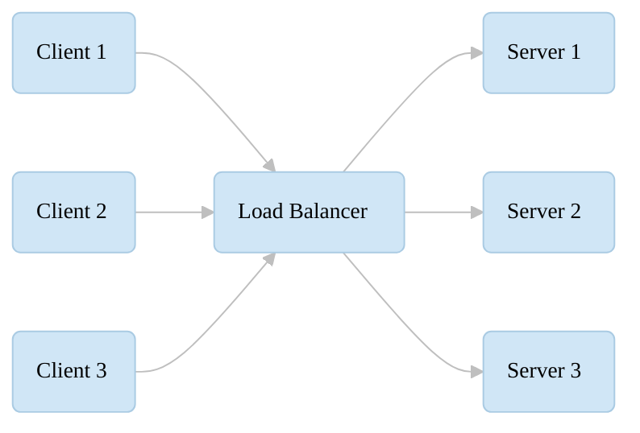
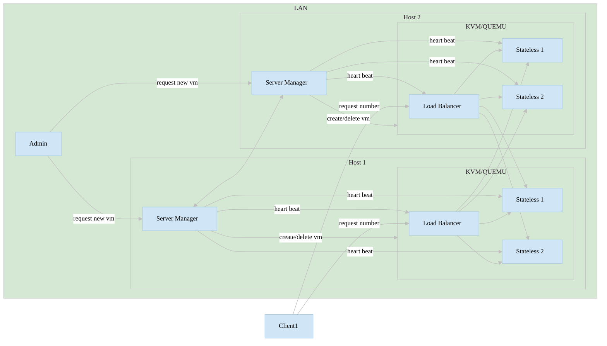

# Ensuring High Availability in a Virtualized Micro-Infrastructure: Failover, Heartbeats, and Automated VM Recovery

In this post, we walk through how we designed and tested a lightweight, high-availability compute environment built entirely on virtual machines, load balancers, heartbeat monitoring, and automated orchestration. The platform uses KVM, Alpine Linux, Spring Boot microservices, and Ansible automation to simulate a real distributed system - and to intentionally break it.

Our goal: **prove that a small, academic proof-of-concept can still behave like a resilient, self-healing cluster.**

---

# 1. Testing Failure Scenarios

We tested three main types of failures: stateless service crashes, load balancer crashes, and VM IP collisions. Each failure triggers a different recovery mechanism, driven by heartbeat monitoring.

---

## 1.1 Stateless Service Crash

A dedicated manager continuously checks the health of all stateless services using simple heartbeat messages:

```json
data: {"status": "OK"}
```

If a service stops responding, the manager retries several times. After four failed attempts, the VM is destroyed and automatically recreated - **with the same IP**, so no reconfiguration is needed.

Meanwhile, Nginx routes traffic to healthy workers using `proxy_next_upstream`, masking the failure from the user.

### Test Flow

1. Kill the VM
2. Observe temporary downtime
3. Requests are routed to other services
4. A new VM is spawned and resumes work

System log excerpt:

```sh
Retries exhausted: 4/4
```

A new instance is spawned immediately afterwards.

---

## 1.2 Load Balancer Crash

The load balancer also emits heartbeat messages. When it's down:

- the master manager detects failure,
- reassigns the single public cluster IP to another LB VM,
- disables the faulty instance,
- and spawns a fresh _secondary_ LB VM.

All of this occurs automatically via Ansible playbooks.

Example automated IP reassignment:

```sh
ansible-playbook -i 192.168.10.25, ./playbooks/network.yaml \
  -e current_ip=192.168.10.25 -e new_ip=192.168.10.120
```

Again, after four heartbeat failures, the manager replaces the LB and restores service continuity.

---

## 1.3 IP Collision Avoidance

Each manager owns its own private IP pool:

```yaml
available-addresses:
  - http://192.168.10.10:8080
  - http://192.168.10.11:8080
  ...
```

Because managers allocate addresses only from their own pool, **IP collisions simply cannot happen**.

---

# 2. Reliability Testing

A simple Bash script bombards the service with requests every 0.5 seconds:

```bash
while true; do
    curl http://192.168.10.120/random/number \
      --connect-timeout 1 --max-time 2 || true
    echo ""
    sleep 0.5
done
```

During deliberate VM failures, users observe a tiny disruption (1-2 seconds). Without strict curl timeouts, the interruptions become nearly invisible, as requests naturally wait for the system to heal.

---

# 3. Tools & Environment

- **Hypervisor:** KVM
- **VM Image:** Alpine Linux
- **Automation:** Ansible
- **Apps:** Spring Boot (Kotlin)
- **Networking:** Nginx load balancer + bridges
- **Cluster Control:** Custom heartbeat-based VM lifecycle manager

Two laptops connected via Ethernet form the entire cluster.

---

# 4. Automation and Deployment

The infrastructure is fully automated:

### Static IP assignment via Ansible:

```yaml
- name: Configure static ip
  template:
    src: config/interfaces.j2
    dest: /etc/network/interfaces
  notify: Restart networking
```

### Launching a stateless service as a daemon:

```yaml
nohup java -jar /stateless.jar --server.port={{ port }} > stateless.log 2>&1 &
```

### Launching the heartbeat listener for the load balancer:

```yaml
nohup java -jar /heartbeat.jar --server.port=8080 > heartbeat.log 2>&1 &
```

### Load balancer configuration (NGINX):

```
upstream stateless {
    server 192.168.10.16:8080;
    server 192.168.10.15:8080;
}
```

---

# 5. Infrastructure: KVM + Alpine Linux

Example VM IP config:

```ini
auto eth0
iface eth0 inet static
    address 192.168.10.200
    netmask 255.255.255.0
    gateway 192.168.10.1
```

<br />



<br />



---

# 6. Result: A Fully Self-Healing Mini-Cloud

Even though this environment is small and academic, it implements features typically found in production-grade systems:

- automatic VM recovery
- load balancer failover
- health checks and heartbeats
- static IP provisioning
- automatic redeployment of services
- resilient routing during failures

The system demonstrates that even a lightweight, portable virtual cloud can behave like a robust distributed platform - with minimal downtime and full automation.
