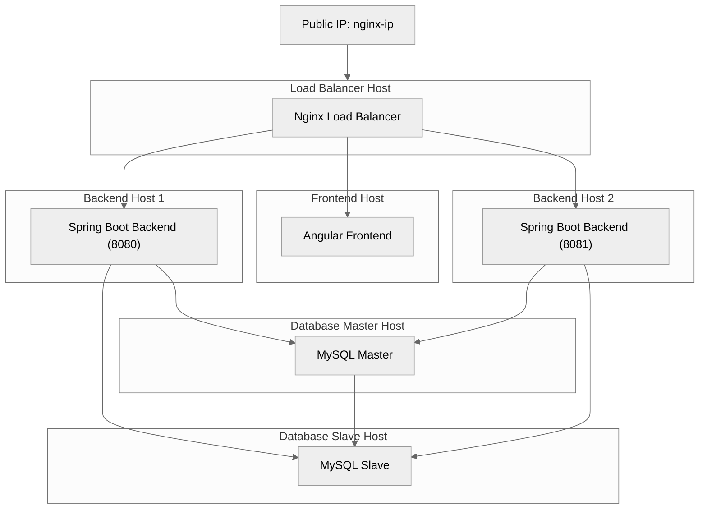

# Spring Petclinic Deployment Automation

This project focuses on automating the full deployment lifecycle of the **Spring Petclinic** application using several different approaches: raw Bash automation, infrastructure-as-code (IaC) with **Ansible**, and container orchestration via **Kubernetes**.

The goal of the project was to understand how different levels of automation influence maintainability, reproducibility, and operational complexity - starting from a single giant Bash script and ending with modern declarative deployments.

The repository includes everything required to spin up a functional multi-tier architecture consisting of:

- **Frontend** (Angular)
- **Backend** (Spring Petclinic REST)
- **MySQL database** (single instance and replicated variants)
- **Nginx** reverse proxy and load balancer
- **Azure infrastructure** (VMs, NSGs, VNet, Public IPs)
- Support for **replication**, **load balancing**, and **scalable deployments**



---

# Deployment Using Bash Scripts

The first approach demonstrates how a fully automated deployment can be built using **only Bash**, the Azure CLI, and a JSON configuration file.

This part of the project uses:

- One master script to deploy the full environment
- Smaller, service-specific scripts (database, backend, frontend, nginx)
- JSON configuration as the single source of truth

It serves as a “minimum abstraction” IaC method where all logic is explicitly scripted.

### What the Bash script automates

- Azure authentication and resource provisioning
- VNet, subnets, and NSG creation
- Public IP allocation
- VM creation with assigned private/public addresses
- Service installation and configuration via `az vm run-command invoke`
- Multi-backend deployments (two backend instances on different ports)
- MySQL master-slave setup
- Nginx load-balancing proxy
- Frontend configuration and build

The provided configuration file determines the entire topology, which means the script can deploy completely different infrastructures simply by modifying JSON.

### Example: Main Deployment Script

```sh
#!/bin/bash

set -euxo pipefail

if [ $# -lt 1 ]; then
  echo 1>&2 "$0: not enough arguments"
  echo "Usage: $0 CONFIG_FILE"
  exit 2
fi

CONFIG_FILE="$1"

echo $CONFIG_FILE

# Instalation
sudo apt-get update
sudo apt-get upgrade -y

sudo apt install jq -y
sudo apt-get install azure-cli -y


RESOURCE_GROUP="$(jq -r '.resource_group' "$CONFIG_FILE")"

echo $RESOURCE_GROUP

# Login
az login

# Resource Group
az group create --name $RESOURCE_GROUP --location westeurope

# Network
NETWORK_ADDRESS_PREFIX="$(jq -r '.network.address_prefix' "$CONFIG_FILE")"

az network vnet create \
    --resource-group $RESOURCE_GROUP \
    --name VNet \
    --address-prefix $NETWORK_ADDRESS_PREFIX

# Network Security Group

readarray -t NETWORK_SECURITY_GROUPS < <(jq -c '.network_security_group[]' "$CONFIG_FILE")

for GROUP in "${NETWORK_SECURITY_GROUPS[@]}"; do
    echo $GROUP

    GROUP_NAME=$(jq -r '.name' <<< $GROUP)

    az network nsg create \
        --resource-group $RESOURCE_GROUP \
        --name $GROUP_NAME

    readarray -t RULES < <(jq -c '.rule[]' <<< $GROUP)

    for RULE in "${RULES[@]}"; do
        echo $RULE

        RULE_NAME=$(jq -r '.name' <<< $RULE)
        RULE_PRIORITY=$(jq -r '.priority' <<< $RULE)
        RULE_SOURCE_ADDRESS_PREFIX=$(jq -r '.source_address_prefixes' <<< $RULE)
        RULE_SOURCE_PORT_RANGES=$(jq -r '.source_port_ranges' <<< $RULE)
        RULE_DESTINATION_ADDRESS_PREFIX=$(jq -r '.destination_address_prefixes' <<< $RULE)
        RULE_DESTINATION_PORT_RANGES=$(jq -r '.destination_port_ranges' <<< $RULE)

        az network nsg rule create \
            --resource-group $RESOURCE_GROUP \
            --nsg-name $GROUP_NAME \
            --name $RULE_NAME \
            --access allow \
            --protocol Tcp \
            --priority $RULE_PRIORITY \
            --source-address-prefix "$RULE_SOURCE_ADDRESS_PREFIX" \
            --source-port-range "$RULE_SOURCE_PORT_RANGES" \
            --destination-address-prefix "$RULE_DESTINATION_ADDRESS_PREFIX" \
            --destination-port-range "$RULE_DESTINATION_PORT_RANGES"
    done
done

# Subnet

readarray -t SUBNETS < <(jq -c '.subnet[]' "$CONFIG_FILE")

for SUBNET in "${SUBNETS[@]}"; do
    echo $SUBNET

    SUBNET_NAME=$(jq -r '.name' <<< $SUBNET)
    SUBNET_ADDRESS_PREFIX=$(jq -r '.address_prefix' <<< $SUBNET)
    SUBNET_NETWORK_SECURITY_GROUP=$(jq -r '.network_security_group' <<< $SUBNET)
    echo $SUBNET_NAME

    az network vnet subnet create \
        --resource-group $RESOURCE_GROUP \
        --vnet-name VNet \
        --name $SUBNET_NAME \
        --address-prefix $SUBNET_ADDRESS_PREFIX \
        --network-security-group "$SUBNET_NETWORK_SECURITY_GROUP"
done

# Public IP

readarray -t PUBLIC_IPS < <(jq -c '.public_ip[]' "$CONFIG_FILE")

for PUBLIC_IP in "${PUBLIC_IPS[@]}"; do
    echo $PUBLIC_IP

    PUBLIC_IP_NAME=$(jq -r '.name' <<< $PUBLIC_IP)

    az network public-ip create \
        --resource-group $RESOURCE_GROUP \
        --name $PUBLIC_IP_NAME
done

# Virtual Machine

readarray -t VIRTUAL_MACHINES < <(jq -c '.virtual_machine[]' "$CONFIG_FILE")

for VM in "${VIRTUAL_MACHINES[@]}"; do
    echo $VM

    VM_NAME=$(jq -r '.name' <<< $VM)
    VM_SUBNET=$(jq -r '.subnet' <<< $VM)
    VM_PRIVATE_IP_ADDRESS=$(jq -r '.private_ip_address' <<< $VM)
    VM_PUBLIC_IP_ADDRESS=$(jq -r '.public_ip_address' <<< $VM)

    az vm create \
        --resource-group $RESOURCE_GROUP \
        --vnet-name VNet \
        --name $VM_NAME \
        --subnet $VM_SUBNET \
        --nsg "" \
        --private-ip-address "$VM_PRIVATE_IP_ADDRESS" \
        --public-ip-address "$VM_PUBLIC_IP_ADDRESS" \
        --image UbuntuLTS \
        --generate-ssh-keys
        
        # --data-disk-sizes-gb 10 \
        # --size Standard_DS2_v2 \
    
    readarray -t DEPLOY < <(jq -c '.deploy[]' <<< $VM)

    for SERVICE in "${DEPLOY[@]}"; do
        echo $SERVICE

        SERVICE_TYPE=$(jq -r '.type' <<< $SERVICE)
        SERVICE_PORT=$(jq -r '.port' <<< $SERVICE)

        case $SERVICE_TYPE in
            frontend)
                echo Setting up frontend

                SERVER_ADDRESS=$(jq -r '.backend_address' <<< $SERVICE)
                SERVER_IP=$(az network public-ip show --resource-group "$RESOURCE_GROUP"  --name "$SERVER_ADDRESS"  --query "ipAddress" --output tsv)
                SERVER_PORT=$(jq -r '.backend_port' <<< $SERVICE)

                az vm run-command invoke \
                    --resource-group $RESOURCE_GROUP \
                    --name $VM_NAME \
                    --command-id RunShellScript \
                    --scripts "@./angular/front.sh" \
                    --parameters "$SERVER_IP" "$SERVER_PORT" "$SERVICE_PORT"
            ;;

            nginx)
                echo Setting up nginx

                READ_SERVER_ADDRESS=$(jq -r '.read.server_address' <<< $SERVICE)
                READ_SERVER_PORT=$(jq -r '.read.server_port' <<< $SERVICE)

                WRITE_SERVER_ADDRESS=$(jq -r '.write.server_address' <<< $SERVICE)
                WRITE_SERVER_PORT=$(jq -r '.write.server_port' <<< $SERVICE)

                az vm run-command invoke \
                    --resource-group $RESOURCE_GROUP \
                    --name $VM_NAME \
                    --command-id RunShellScript \
                    --scripts '@./nginx/nginx.sh' \
                    --parameters "$SERVICE_PORT"  "$READ_SERVER_ADDRESS" "$READ_SERVER_PORT"  "$WRITE_SERVER_ADDRESS" "$WRITE_SERVER_PORT"
            ;;

            backend)
                echo Setting up backend

                DATABASE_ADDRESS=$(jq -r '.database_ip' <<< $SERVICE)
                DATABASE_PORT=$(jq -r '.database_port' <<< $SERVICE)
                DATABASE_USER=$(jq -r '.database_user' <<< $SERVICE)
                DATABASE_PASSWORD=$(jq -r '.database_password' <<< $SERVICE)

                az vm run-command invoke \
                    --resource-group $RESOURCE_GROUP \
                    --name $VM_NAME \
                    --command-id RunShellScript \
                    --scripts "@./rest/spring.sh" \
                    --parameters "$SERVICE_PORT" "$DATABASE_ADDRESS" "$DATABASE_PORT" "$DATABASE_USER" "$DATABASE_PASSWORD"
            ;;

            backend-replicaset)
                echo Setting up backend with replicaset

                DATABASE_MASTER_ADDRESS=$(jq -r '.database_master_ip' <<< $SERVICE)
                DATABASE_MASTER_PORT=$(jq -r '.database_master_port' <<< $SERVICE)
                DATABASE_SLAVE_ADDRESS=$(jq -r '.database_slave_ip' <<< $SERVICE)
                DATABASE_SLAVE_PORT=$(jq -r '.database_slave_port' <<< $SERVICE)
                DATABASE_USER=$(jq -r '.database_user' <<< $SERVICE)
                DATABASE_PASSWORD=$(jq -r '.database_password' <<< $SERVICE)

                az vm run-command invoke \
                    --resource-group $RESOURCE_GROUP \
                    --name $VM_NAME \
                    --command-id RunShellScript \
                    --scripts "@./rest/spring-replicaset.sh" \
                    --parameters "$SERVICE_PORT" "$DATABASE_MASTER_ADDRESS" "$DATABASE_MASTER_PORT" "$DATABASE_SLAVE_ADDRESS" "$DATABASE_SLAVE_PORT" "$DATABASE_USER" "$DATABASE_PASSWORD"
            ;;

            database)
                echo Setting up database

                DATABASE_USER=$(jq -r '.user' <<< $SERVICE)
                DATABASE_PASSWORD=$(jq -r '.password' <<< $SERVICE)

                az vm run-command invoke \
                    --resource-group $RESOURCE_GROUP \
                    --name $VM_NAME \
                    --command-id RunShellScript \
                    --scripts "@./mySql/sql.sh" \
                    --parameters "$SERVICE_PORT" "$DATABASE_USER" "$DATABASE_PASSWORD"
            ;;

            database-slave)
                echo Setting up database slave

                DATABASE_USER=$(jq -r '.user' <<< $SERVICE)
                DATABASE_PASSWORD=$(jq -r '.password' <<< $SERVICE)
                MASTER_DATABASE_ADDRESS=$(jq -r '.master_address' <<< $SERVICE)
                MASTER_DATABASE_PORT=$(jq -r '.master_port' <<< $SERVICE)

                az vm run-command invoke \
                    --resource-group $RESOURCE_GROUP \
                    --name $VM_NAME \
                    --command-id RunShellScript \
                    --scripts "@./mySql/sql-slave.sh" \
                    --parameters "$SERVICE_PORT" "$DATABASE_USER" "$DATABASE_PASSWORD" "$MASTER_DATABASE_ADDRESS" "$MASTER_DATABASE_PORT"
            ;;

            *)
                echo 1>&2 "Unknown service type!"
                exit 1
            ;;
        esac
    done
done

for PUBLIC_IP in "${PUBLIC_IPS[@]}"; do
    echo $PUBLIC_IP

    PUBLIC_IP_NAME=$(jq -r '.name' <<< $PUBLIC_IP)

    az network public-ip show \
      --resource-group "$RESOURCE_GROUP" \
      --name "$PUBLIC_IP_NAME" \
      --query "ipAddress" \
      --output tsv
done

# Logout
az logout
```

## Example Configuration

The deployment supports flexible and highly customized layouts.
A single JSON file defines:

- resource group
- network layout
- security groups
- subnets
- public IPs
- VMs and their services
- master/slave DB replication
- multiple backend instances
- nginx routing rules

```json
{
    "resource_group": "wusLabGroup",
    "network": {
        "address_prefix": "10.0.0.0/16"
    },
    "network_security_group": [
        {
            "name": "frontendNSG",
            "rule": [
                {
                    "name": "frontRule",
                    "priority": 1000,
                    "source_address_prefixes": "*",
                    "source_port_ranges": "*",
                    "destination_address_prefixes": "*",
                    "destination_port_ranges": "22-8081"
                }
            ]
        },
        {
            "name": "backendNSG",
            "rule": [
                {
                    "name": "backendRule",
                    "priority": 1000,
                    "source_address_prefixes": "10.0.0.0/16",
                    "source_port_ranges": "*",
                    "destination_address_prefixes": "*",
                    "destination_port_ranges": "8080-8081"
                }
            ]
        },
        {
            "name": "databaseNSG",
            "rule": [
                {
                    "name": "databaseRule",
                    "priority": 1000,
                    "source_address_prefixes": "10.0.0.0/16",
                    "source_port_ranges": "*",
                    "destination_address_prefixes": "*",
                    "destination_port_ranges": 3306
                }
            ]
        }
    ],
    "subnet": [
        {
            "name": "frontendSubnet",
            "address_prefix": "10.0.1.0/24",
            "network_security_group": "frontendNSG"
        },
        {
            "name": "backendSubnet",
            "address_prefix": "10.0.3.0/24",
            "network_security_group": "backendNSG"
        },
        {
            "name": "databaseSubnet",
            "address_prefix": "10.0.4.0/24",
            "network_security_group": "databaseNSG"
        }
    ],
    "public_ip": [
        {
            "name": "front"
        }
    ],
    "virtual_machine": [
        {
            "name": "databaseMasterVM",
            "subnet": "databaseSubnet",
            "private_ip_address": "10.0.4.10",
            "public_ip_address": "",
            "deploy": [
                {
                    "type": "database",
                    "port": 3306,
                    "user": "user",
                    "password": "password"
                }
            ]
        },
        {
            "name": "databaseSlaveVM",
            "subnet": "databaseSubnet",
            "private_ip_address": "10.0.4.11",
            "public_ip_address": "",
            "deploy": [
                {
                    "type": "database-slave",
                    "port": 3306,
                    "user": "user",
                    "password": "password",
                    "master_address": "10.0.4.10",
                    "master_port": 3306
                }
            ]
        },
        {
            "name": "backendVM",
            "subnet": "backendSubnet",
            "private_ip_address": "10.0.3.10",
            "public_ip_address": "",
            "deploy": [
                {
                    "type": "backend",
                    "port": 8080,
                    "database_ip": "10.0.4.10",
                    "database_port": 3306,
                    "database_user": "user",
                    "database_password": "password"
                },
                {
                    "type": "backend",
                    "port": 8081,
                    "database_ip": "10.0.4.11",
                    "database_port": 3306,
                    "database_user": "user",
                    "database_password": "password"
                }
            ]
        },
        {
            "name": "frontendVM",
            "subnet": "frontendSubnet",
            "private_ip_address": "10.0.1.10",
            "public_ip_address": "front",
            "deploy": [
                {
                    "type": "nginx",
                    "port": 8081,
                    "read": {
                        "server_address": "10.0.3.10",
                        "server_port": 8081
                    },
                    "write": {
                        "server_address": "10.0.3.10",
                        "server_port": 8080
                    }
                },
                {
                    "type": "frontend",
                    "port": 8080,
                    "backend_address": "front",
                    "backend_port": 8081
                }
            ]
        }
    ]
}
```

This demonstrates how far we can push automation with plain Bash.
However, scaling this approach becomes difficult - which leads naturally to the next technique: **Ansible**.


---

# Deployment Using Ansible

After experimenting with Bash, the project moves toward a more maintainable and declarative IaC model: **Ansible**.

Ansible provides:

- **Role-based structure** (frontend, backend, nginx, db_master, db_slave…)
- **Idempotency**
- **Cleaner host inventories**
- **Declarative configuration**
- Automatic installation, configuration, and service startup

Instead of manually orchestrating commands, Ansible organizes the deployment into reusable roles and an inventory that describes the system layout.

### Main Playbook

The playbook orchestrates deployment across multiple VM groups:


```yml
---

- hosts: 
  - all
  - localhost
  become: true
  pre_tasks:
    - name: Update repository index
      apt:
        update_cache: yes
    
    - name: Upgrade packages
      apt:
        upgrade: dist

- hosts: 
  - frontend
  roles:
    - frontend

- hosts:
  - db_master
  - db_slave
  become: true
  roles:
    - db_base

- hosts:
  - db_master
  become: true
  roles:
    - db_master

- hosts:
  - db_slave
  become: true
  roles:
    - db_slave

- hosts: 
  - backend
  - backend_replicaset
  become: true
  roles:
    - backend_base

- hosts:
  - backend
  become: true
  roles:
    - backend

- hosts:
  - backend_replicaset
  become: true
  roles:
    - backend_replicaset
  
- hosts:
  - nginx
  become: true
  roles:
    - nginx
```

### Inventory Example

The inventory defines each VM, environment variables, ports, and groupings for roles:

```yml
all:
  hosts:
    hostFront:
      vm_name: front
      ansible_user: <AZURE_USER>
      ansible_ssh_private_key_file: <PUBLIC_KEY>
      ansible_host: <FRONT_IP>
    hostBack:
      vm_name: back
      ansible_user: <AZURE_USER>
      ansible_ssh_private_key_file: <PUBLIC_KEY>
      ansible_host: <BACK_IP>
    hostDb:
      vm_name: database
      ansible_user: <AZURE_USER>
      ansible_ssh_private_key_file: <PUBLIC_KEY>
      ansible_host: <DATABASE_IP>
  children:
    frontend:
      hosts:
        hostFront:
          frontend_port: 8080
          backend_address: <FRONT_IP>
          backend_port: 8078
    nginx:
      hosts:
        hostFront:
          nginx_port: 8078
          read_backend_address: 10.0.2.10
          read_backend_port: 8080
          write_backend_address: 10.0.2.10
          write_backend_port: 8079
    backend:
      hosts:
        hostBack:
          parameters:
            - backend_port: 8079
              database_address: 10.0.2.10
              database_port: 3037
              database_user: admin
              database_password: password
              directory: first
            - backend_port: 8080
              database_address: 10.0.3.10
              database_port: 3036
              database_user: admin
              database_password: password
              directory: second
    db_master:
      hosts:
        hostDb:
          database_port: 3036
          database_user: admin
          database_password: password
    db_slave:
      hosts:
        hostBack:
          database_port: 3037
          database_user: admin
          database_password: password
          master_database_address: 10.0.3.10
          master_database_port: 3036
```


### Backend Deployment (Example Role)

Ansible handles cloning, building, configuration injection, and running the backend:

```yml
- name: Install java
  apt:
    name: openjdk-8-jdk
    state: latest

- name: Clone spring repository
  ansible.builtin.git:
    repo: https://github.com/spring-petclinic/spring-petclinic-rest.git
    dest: /home/{{ ansible_user }}/WUS-LABY/tmp/{{ item.directory }}/spring-petclinic-rest
    force: yes
  loop: "{{ parameters }}"

- name: Copy prepared backend configuration
  ansible.builtin.copy:
    src: application.properties
    dest: /home/{{ ansible_user }}/WUS-LABY/tmp/{{ item.directory }}/spring-petclinic-rest/src/main/resources/application.properties
  loop: "{{ parameters }}"

- name: Replace values in configuration
  ansible.builtin.script:
    cmd: back.sh {{ item.backend_port }} {{ item.database_address }} {{ item.database_port }} {{ item.database_user }} {{ item.database_password }}
    chdir: /home/{{ ansible_user }}/WUS-LABY/tmp/{{ item.directory }}/spring-petclinic-rest/src/main/resources/
  loop: "{{ parameters }}"

- name: Test spring application
  ansible.builtin.shell:
    cmd: ./mvnw test
    chdir: /home/{{ ansible_user }}/WUS-LABY/tmp/{{ item.directory }}/spring-petclinic-rest
  loop: "{{ parameters }}"

- name: Build spring application
  async: 3600
  poll: 0
  ansible.builtin.shell:
    cmd: ./mvnw spring-boot:run
    chdir: /home/{{ ansible_user }}/WUS-LABY/tmp/{{ item.directory }}/spring-petclinic-rest
  loop: "{{ parameters }}"
```


## Database Deployment

```yml
- name: Install mysql-server
  apt:
    name: mysql-server
    state: latest

- name: Install wget
  apt:
    name: wget
    state: latest

- name: Create target directory
  file: path=/home/{{ ansible_user }}/master/ state=directory mode=0755

- name: Copy sql.sh
  ansible.builtin.copy:
    src: sql.sh
    dest: /home/{{ ansible_user }}/master/sql.sh
    mode: 'u+x,g+x'

- name: Run sql.sh
  ansible.builtin.shell:
    cmd: ./sql.sh {{ database_port }} {{ database_user }} {{ database_password }}
    chdir: /home/{{ ansible_user }}/master/
```


## Nginx Deployment


```yml
- name: Install nginx
  apt:
    name: nginx
    state: latest

- name: Install wget
  apt:
    name: wget
    state: latest

- name: Copy nginx configuration
  ansible.builtin.copy:
    src: nginx.conf
    dest: /etc/nginx/conf.d/lb.conf

- name: Replace values in configuration
  ansible.builtin.script:
    cmd: nginx.sh {{ nginx_port }} {{ read_backend_address }} {{ read_backend_port }} {{ write_backend_address }} {{ write_backend_port }}

- name: Restart service nginx
  ansible.builtin.systemd:
    name: nginx.service
    state: restarted
    daemon_reload: yes
```


## Frontend Deployment


```yml
- name: Install curl
  become: true
  apt:
    name: curl
    state: latest

- name: Clone spring repository
  ansible.builtin.git:
    repo: https://github.com/spring-petclinic/spring-petclinic-angular.git
    dest: /home/{{ ansible_user }}/spring-petclinic-angular/
    force: yes

- name: Update configuration
  ansible.builtin.script:
    cmd: front.sh {{ backend_address }} {{ backend_port }}
    chdir: /home/{{ ansible_user }}/spring-petclinic-angular/

- name: Copy run script
  ansible.builtin.copy:
    src: install.sh
    dest: /home/{{ ansible_user }}/install.sh

- name: Add execute privileges
  become: true
  ansible.builtin.command:
    cmd: chmod +x ./install.sh
    chdir: /home/{{ ansible_user }}/

- name: Install package manager and deploy application
  async: 3600
  poll: 0
  ansible.builtin.command:
    cmd: ./install.sh {{ frontend_port }}
    chdir: /home/{{ ansible_user }}/
```

This approach is far more maintainable than the Bash-only method.
Infrastructure changes are isolated in roles, and entire environments can be recreated from scratch with a single command:

```
ansible-playbook deploy.yml -vvv
```

---

# Kubernetes Deployment

Finally, the project explores deploying Spring Petclinic using **Kubernetes**, including:

- Custom resource definitions provided by the Spring Petclinic maintainers
- Helm-managed MySQL databases
- Automated service discovery
- Namespaces and initial service setups
- A deployment script for the full microservices stack

Although most of the Kubernetes manifests are derived from the upstream Petclinic repository, the project extends and studies:

- Namespace initialization
- Database setup using Bitnami Helm charts
- Deployment order
- Accessing the final exposed gateway service

### Kubernetes Deployment Script

```sh

#!/bin/bash

set -euxo pipefail

cd spring-petclinic-cloud/

kubectl apply -f k8s/init-namespace

kubectl apply -f k8s/init-services

helm repo add bitnami https://charts.bitnami.com/bitnami
helm repo update

# helm search repo bitnami

helm install vets-db-mysql bitnami/mysql --namespace spring-petclinic --version 9.4.6 --set auth.database=service_instance_db
helm install visits-db-mysql bitnami/mysql --namespace spring-petclinic  --version 9.4.6 --set auth.database=service_instance_db
helm install customers-db-mysql bitnami/mysql --namespace spring-petclinic  --version 9.4.6 --set auth.database=service_instance_db

export REPOSITORY_PREFIX=springcommunity

./scripts/deployToKubernetes.sh

kubectl get svc -n spring-petclinic

kubectl get pods --all-namespaces

kubectl get svc -n spring-petclinic api-gateway
```

After applying the manifests, Kubernetes exposes the application through the API Gateway, and the cluster can be inspected with:

```
kubectl get svc -n spring-petclinic
kubectl get pods --all-namespaces
```

---

# Summary

This project demonstrates three different approaches to deploying a real-world application:

1. **Raw Bash automation**

   * Full control over every detail
   * Hard to maintain at scale
   * Ideal for learning fundamentals of cloud automation

2. **Ansible (IaC)**

   * Declarative, modular, and repeatable
   * Much easier to extend and manage
   * Eliminates most manual orchestration

3. **Kubernetes**

   * Cloud-native, scalable, production-ready
   * Built-in load balancing, discovery, and resilience
   * Excellent for microservice-based deployments

Together, these approaches provide a full perspective on automation - from low-level scripting to modern orchestration frameworks.
